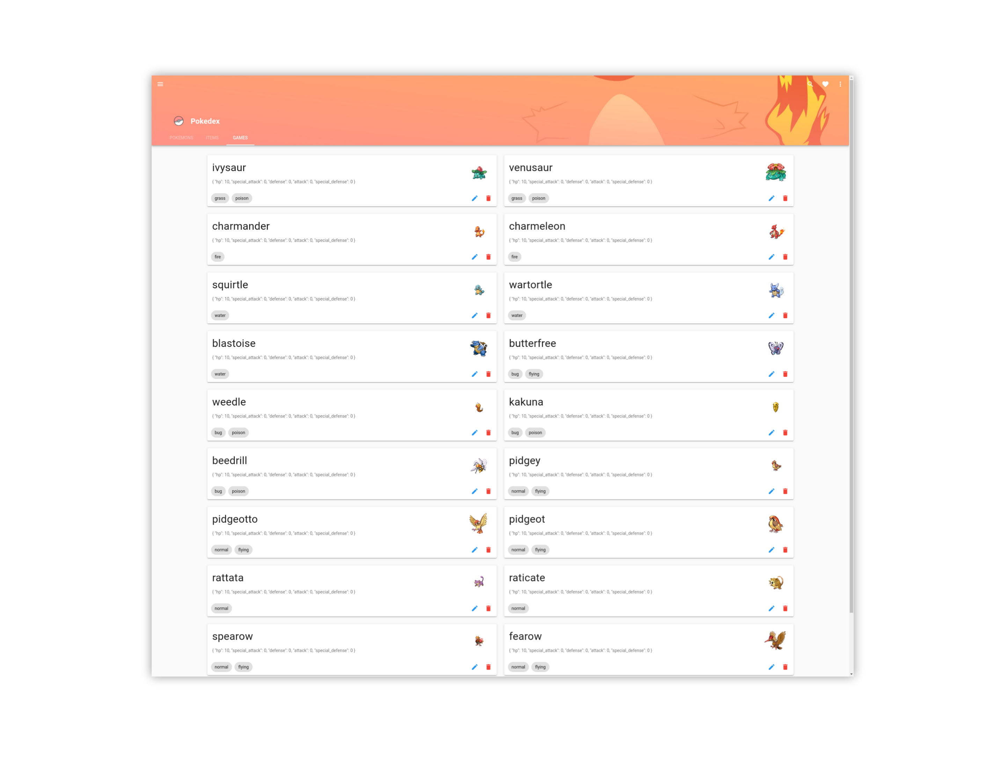

 

# Pokedex

This project is a template for beginners in full-stack, creating a pokedex interface to train on.



## How to use

#### Infrastructure

To launch the infrastructure needed (database), we use Docker and Docker-compose :

```
$ docker-compose up -d
```

#### Back-end

To launch the backend, we need first to create a virtualenv and install the requirements once :

```
$ cd back/
$ virtualenv --python=python3 venv
$ source venv/bin/activate
(venv) $ pip install -r requirements.txt
```

Then to launch it everytime :

```
$ cd back/
$ source venv/bin/activate
(venv) $ python run.py
```

#### Front-end

To launch the front, we need first to install the requirements once :

```
$ cd front/
$ npm install
```

Then to launch it everytime :

```
$ cd front/
$ npm run serve
```

#### Pycharm configuration

In this project, Pycharm is already configured with the right database and the right run configurations : the backend and
the frontend ones.
